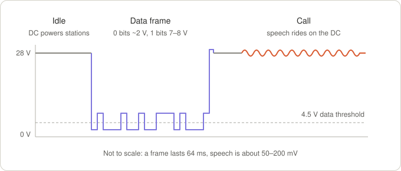
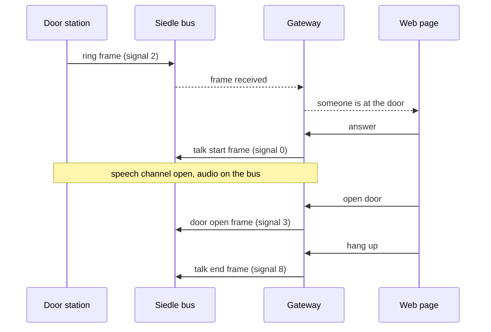
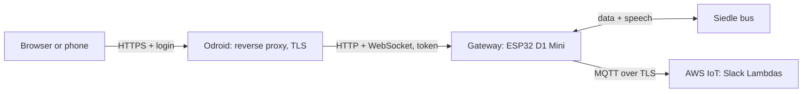
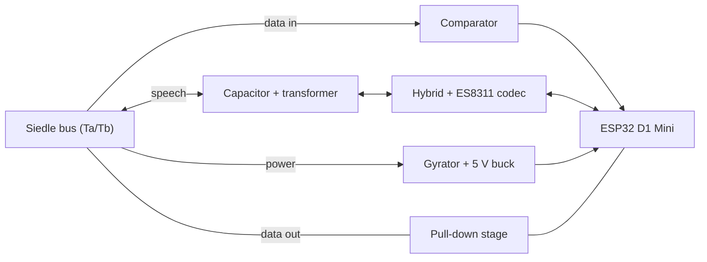

Audio: Answering the Door from the Browser
====

When someone rings, people in the office should be able to answer from a web page, talk to the visitor and open
the door, instead of only seeing the ring in Slack. This page collects how the Siedle bus carries speech, the
planned hardware and firmware, and the decisions taken so far.

**Status:** design. The audio part is not built yet. Statements marked *to be measured* depend on the scope
session described in [Bus-Measurements.md](Bus-Measurements.md).

Decisions so far
----

- **Board:** AZ-Delivery ESP32 D1 Mini (classic ESP32, 4 MB flash, no PSRAM).
- **Power:** from the bus through a gyrator, see [Bus-Power.md](Bus-Power.md). An external 5 V supply is the fallback.
- **Audio:** ES8311 codec, transformer coupling to the bus, push-to-talk first.
- **Web page:** served by the gateway behind the Odroid, which terminates TLS and handles the login. The gateway
  itself stays plain HTTP on the LAN.
- **Phones outside the office:** later, through a VPN into the office network.
- **PCB:** later, with KiCad.

How the Siedle In-Home bus carries speech
----



The bus uses the same two wires (Ta/Tb) for three things:

- **Power:** about 28 V DC from the bus power supply feeds every station.
- **Data:** 32-bit frames, MSB first, 2 ms per bit. A station pulls the bus below about 4.5 V for every 0 bit.
  The firmware decodes these today (`siedle_proto`).
- **Speech:** during a call, the voice rides on the DC as a small AC voltage, as on an analog telephone line.

This works because the bus power supply feeds the wires through a high impedance for AC (a choke or its electronic
equivalent). A station that varies its current with its speech varies the bus voltage, and every other station
hears that as a small AC voltage. Both directions share the pair, so each station separates what it sends from
what it receives with a hybrid circuit (*Gabelschaltung*), as known from telephony.

The flip side: every device on the bus must have a high impedance at audio frequencies. A plain rectifier with
large capacitors, like the Arduino prototype's input, is close to a short circuit for speech and makes calls
quieter for the whole building (see the "Eingangskondensator dämpft Audio auf Busleitung" thread in
[ReverseEngineering.md](ReverseEngineering.md)). The [bus power stage](Bus-Power.md) solves that.

| | Status |
|---|---|
| Frame format, bit timing, signals (ring, talk start, door open, talk end) | known, used by the firmware |
| Speech as AC on the same pair, devices need a high AC impedance | very likely (principle, forum thread) |
| Speech level, bandwidth, bus impedance | to be measured |
| Both directions at once, or voice switching at the door station | to be measured |
| Audio on the bus before someone picks up | to be measured |
| DC current of a talking station | to be measured |
| Current budget of the bus power supply | Siedle system manual, plus measurement |

A call on the bus
----



The signal numbers are the ones in `lambda/siedle.json`. For a call from the web page, the gateway takes the role
of an indoor station: it sends *talk start*, puts speech on and takes speech off the bus, and sends *talk end*.
To be tested: which address the gateway answers with (for example the one of the cron IT indoor phone), and what
happens when a real handset is picked up at the same moment.

Architecture
----



- **The Odroid terminates TLS** (Nginx Proxy Manager as a Home Assistant add-on, or the proxy that already serves
  Home Assistant) and handles the login. Browsers only allow microphone access on HTTPS pages. This way the
  gateway needs no certificate and saves the RAM of TLS server connections.
- **The gateway accepts call and door commands only with a secret token** that the proxy adds to every request.
  Otherwise anyone on the LAN could bypass the login by talking to the gateway directly. The read-only status page
  stays open on the LAN.
- **Phones outside the office** connect through a VPN into the office network (WireGuard or Tailscale, both
  available as Home Assistant add-ons). The door opener is never exposed to the internet, and no WebRTC or cloud
  relay is needed.
- **Slack stays** for everyone away from a computer. The ring message gets a link to the web page.

Hardware
----

### Board: AZ-Delivery ESP32 D1 Mini

ESP32-WROOM-32 module (ESP32-D0WD-V3), 4 MB flash, no PSRAM, CP2104 USB serial chip, 5 V input with an onboard
3.3 V regulator, D1 Mini form factor. The firmware already targets this chip and flash size.

- **No PSRAM:** start with push-to-talk. Full duplex echo cancellation with ESP-SR needs an ESP32-S3, a lighter
  echo canceller (speexdsp) may fit later.
- **Probably no BOOT button** (the board follows the MH-ET LIVE MiniKit design, which only has a reset button). The
  Wi-Fi reset and admin hotspot need a button on the interface board. For development, a push button between
  GPIO0 and GND works, as long as it isn't held during a reset.
- **Carrier board:** the D1 Mini plugs onto the interface board.

### Bus interface



- **Data in:** a comparator with hysteresis turns the bus voltage into a clean digital signal for the RMT
  peripheral, with its threshold between the ~4.5 V low level and the idle level. A second comparator at about
  12 V replaces the ADC based "acknowledged" check of the Arduino firmware.
- **Data out:** the existing transistor stage that pulls the bus down.
- **Speech:** a film capacitor blocks the DC, a small 600 Ω audio transformer couples the speech, an op-amp hybrid
  splits send and receive, and an ES8311 codec digitizes (ADC) and produces (DAC) the audio on I2S. If the
  measurements show that the bus expects current modulation like a telephone line, only the send side changes,
  into a transistor current stage.
- **Power:** [Bus-Power.md](Bus-Power.md).
- **Protection:** PTC fuse and TVS diode at the bus terminals.

This is a concept. Component values follow from the measurements.

### Draft pin plan

| Function | GPIO | Why this pin |
|---|---|---|
| Data in (comparator) | 34 | input-only, RMT receive |
| Acknowledge (≥ 12 V comparator) | 35 | input-only |
| VOUT of the power stage | 36 | ADC1, Wi-Fi start (see [Bus-Power.md](Bus-Power.md#firmware-requirement)) |
| Data out, carrier | 16, 17 | free on WROOM modules, no boot role |
| Codec control (I2C SDA, SCL) | 21, 22 | the D1 Mini's usual I2C pins |
| Codec audio (I2S BCLK, WS, DOUT, DIN) | 26, 25, 27, 32 | no boot role |
| Codec MCLK, if needed | 0 | only GPIO 0, 1 or 3 can output it on the classic ESP32 |
| Wi-Fi / admin button | 33 | internal pull-up, no boot role |
| Status LED | 2 | the board's blue LED |

Constraints behind it: GPIO 34–39 are input-only, only ADC1 works while Wi-Fi runs, and the strapping pins (0, 2, 5,
12, 15) must not disturb booting, GPIO 12 in particular has to be low at boot. Whether the ES8311 can run off the
I2S bit clock instead of MCLK, freeing GPIO0, still has to be checked in its driver.

Firmware
----

### Audio path

- I2S at 16 kHz, 16-bit mono, in 20 ms frames. Uncompressed that is 256 kbit/s per direction, trivial on the LAN.
- **Bus → browser:** I2S read, high-pass filter against hum, WebSocket binary frame.
- **Browser → bus:** WebSocket, jitter buffer of 60–80 ms, I2S write.

### Echo

The gateway's own voice comes back on the same pair. The first version uses push-to-talk: while someone holds
"Talk", the bus → browser direction is muted. Full duplex later needs the analog hybrid plus digital echo
cancellation. On the browser side, the browser cancels its own echo (`getUserMedia` with `echoCancellation`).

### Call control

A small state machine: idle → ringing (ring frame for our address) → in call (after "answer": talk start frame
sent, audio open) → idle (hang up: talk end frame, or a timeout, or a real handset took the call). Only one person
answers at a time.

### Web API (draft)

| Endpoint | Purpose |
|---|---|
| `GET /call` | call page |
| `GET /api/call` (WebSocket) | call state, commands and audio |

On the WebSocket:

- Text frames from the gateway: `{"type":"state","state":"idle|ringing|in_call","answered_by":"…"}`
- Text frames from the page: `{"type":"answer","name":"…"}`, `{"type":"talk","on":true|false}`,
  `{"type":"open_door"}`, `{"type":"hangup"}`
- Binary frames in both directions: 16 kHz, 16-bit signed little endian, mono, 20 ms (640 bytes). Only the
  client that answered sends and receives audio.

Both endpoints require the token header added by the proxy.

### Resources

The classic ESP32 has enough headroom for one or two listeners: about 200 KB of heap are free today, and without
TLS on the gateway no RAM goes into TLS server connections.

Web page
----

1. The bell rings: every open page chimes and shows "Someone is at the door", plus a browser notification.
2. Answer, then hold "Talk" to speak.
3. Open door, hang up. Everyone else sees "answered by …".

For development without the proxy, Chrome can treat a single `http://` address as secure
(`chrome://flags/#unsafely-treat-insecure-origin-as-secure`), which enables the microphone there.

Odroid setup
----

- A reverse proxy with a valid certificate: Nginx Proxy Manager as a Home Assistant add-on, or the proxy already in
  front of Home Assistant. A wildcard certificate for internal names can be reused.
- WebSocket forwarding enabled, a login in front of the page (at least an access list), and the token header.
- A DHCP reservation for the gateway: `.local` names often don't resolve inside Home Assistant's add-on containers.

The equivalent nginx configuration:

```nginx
location / {
    proxy_pass http://<gateway-ip>;
    proxy_http_version 1.1;
    proxy_set_header Upgrade $http_upgrade;
    proxy_set_header Connection "upgrade";
    proxy_set_header X-Gateway-Token "<secret>";
    proxy_read_timeout 1h;
}
```

Security
----

- Whoever can use the page can open the door. The page needs a login.
- The token keeps LAN clients from bypassing the proxy. It travels unencrypted on the LAN hop, so the hardened
  version uses TLS between the Odroid and the gateway, with a self-signed certificate the proxy is configured to
  trust. Browsers never see that certificate.
- Remote access only through the VPN, never by exposing the gateway or the page to the internet.
- The admin settings (AWS identity, hotspot password) stay on the setup hotspot, which needs physical access.

Optional: Home Assistant
----

If Home Assistant's MQTT broker (Mosquitto add-on) runs on the Odroid, the gateway can also publish ring and door
events there. Home Assistant picks them up as a doorbell device, which allows automations and push notifications
through the Home Assistant app. Talking stays on the gateway's page, two-way audio inside Home Assistant is less
mature.

Plan
----

1. Measure the bus ([Bus-Measurements.md](Bus-Measurements.md)), including the voltage drop under a known load and
   the longest time the bus stays low during frames.
2. Build the power stage on a breadboard ([Bus-Power.md](Bus-Power.md)).
3. Software spike: call page and WebSocket audio on the dev board with a test tone and a loopback instead of the
   bus, served through the Odroid. Proves the HTTPS microphone path, the latency and the protocol.
4. Listen-only audio front end on the breadboard (transformer, ES8311 module): hear the door in the browser.
5. Push-to-talk and call control (answer, open door, hang up), plus the link in the Slack message.
6. Interface PCB as a carrier board for the D1 Mini (KiCad).
7. Later: full duplex, Home Assistant integration, VPN for phones.

Open questions
----

- The measurement items in the table above.
- Which bus address the gateway answers with, and what happens when a real handset picks up at the same time.
- The current budget of the bus power supply.
- Board details: is there a BOOT button, and a diode on the USB 5 V line?
- Can the ES8311 run off the I2S bit clock, or does it need MCLK on GPIO0?
- Login method on the proxy: access list or single sign-on.
