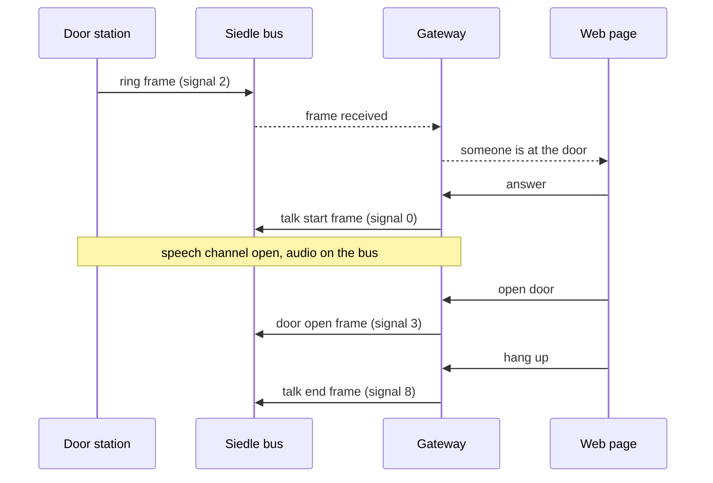
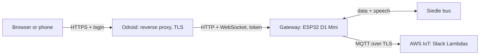
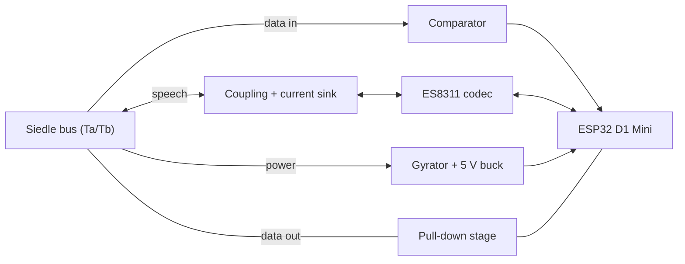

Audio: Answering the Door from the Browser
====

When someone rings, people in the office should be able to answer from a web page, talk to the visitor and open
the door, instead of only seeing the ring in Slack. This page collects how the Siedle bus carries speech, the
planned hardware and firmware, and the decisions taken so far.

**Status:** design. The audio part is not built yet. Statements marked *to be measured* depend on the scope
session described in [Bus-Measurements.md](Bus-Measurements.md).

Decisions so far
----

- **Board:** AZ-Delivery ESP32 D1 Mini (classic ESP32, 4 MB flash, no PSRAM).
- **Power:** from the bus through a gyrator, see [Bus-Power.md](Bus-Power.md). An external 5 V supply is the fallback.
- **Audio:** ES8311 codec for both directions, a coupling capacitor to receive, a transistor current sink to send,
  push-to-talk first.
- **Web page:** served by the gateway behind the Odroid, which terminates TLS and handles the login. The gateway
  itself stays plain HTTP on the LAN.
- **Phones outside the office:** later, through a VPN into the office network.
- **PCB:** later, with KiCad.

How the Siedle In-Home bus carries speech
----


The bus uses the same two wires (Ta/Tb) for three things:

- **Power:** about 28 V DC from the bus power supply feeds every station.
- **Data:** 32-bit frames (telegrams), MSB first, 2 ms per bit. During a telegram the bus sits at about 2 V for a
  0 bit and 7–8 V for a 1 bit, and returns to idle afterwards. The firmware decodes these today (`siedle_proto`).
- **Speech:** during a call, the voice rides on the DC as a small AC voltage, as on an analog telephone line.

This works because the bus power supply feeds the wires through a high impedance for AC (a choke or its electronic
equivalent). A station that varies its current with its speech varies the bus voltage, and every other station
hears that as a small AC voltage. Both directions share the pair, so each station separates what it sends from
what it receives with a hybrid circuit (*Gabelschaltung*), as known from telephony.

The flip side: every device on the bus must have a high impedance at audio frequencies. A plain rectifier with
large capacitors, like the Arduino prototype's input, is close to a short circuit for speech and makes calls
quieter for the whole building (see the "Eingangskondensator dämpft Audio auf Busleitung" thread in
[ReverseEngineering.md](ReverseEngineering.md)). The [bus power stage](Bus-Power.md) solves that.

What is known so far, mostly from [other projects](ReverseEngineering.md#findings-from-other-projects):

| | Status |
|---|---|
| Frame format, bit timing, signals (ring, talk start, door open, talk end) | known, used by the firmware |
| Speech as plain analog audio on the same pair, in both directions | confirmed by others (test tone measured 1:1) |
| Devices need a high impedance at audio frequencies | confirmed by others (220 µF made the door speaker "very, very quiet") |
| Speech level | about 50–200 mV according to others, to be measured |
| Bandwidth, bus impedance | to be measured |
| Audio on the bus before someone picks up | probably not: speech only starts after talk start |
| Concurrent calls | one speech channel per installation, whoever answers first gets it |
| DC current of a talking station | 30 mA for an indoor station, 80 mA for the door loudspeaker (system manual) |
| Current budget for the gateway | no official figure, depends on our power supply (see [Bus-Power.md](Bus-Power.md#bus-voltage-and-current-budget)) |

No open project handles Siedle In-Home audio yet. Existing ones (ESPHome, FHEM, AVR) stop at telegrams.

A call on the bus
----



The signal numbers are the ones in `lambda/siedle.json`. For a call from the web page, the gateway takes the role
of an indoor station: it sends *talk start*, puts speech on and takes speech off the bus, and sends *talk end*.
To be tested: which address the gateway answers with (for example the one of the cron IT indoor phone), and what
happens when a real handset is picked up at the same moment.

Architecture
----



- **The Odroid terminates TLS** (Nginx Proxy Manager as a Home Assistant add-on, or the proxy that already serves
  Home Assistant) and handles the login. Browsers only allow microphone access on HTTPS pages. This way the
  gateway needs no certificate and saves the RAM of TLS server connections.
- **The gateway accepts call and door commands only with a secret token** that the proxy adds to every request.
  Otherwise anyone on the LAN could bypass the login by talking to the gateway directly. The read-only status page
  stays open on the LAN.
- **Phones outside the office** connect through a VPN into the office network (WireGuard or Tailscale, both
  available as Home Assistant add-ons). The door opener is never exposed to the internet, and no WebRTC or cloud
  relay is needed.
- **Slack stays** for everyone away from a computer. The ring message gets a link to the web page.

Hardware
----

### Board: AZ-Delivery ESP32 D1 Mini

ESP32-WROOM-32 module (ESP32-D0WD-V3), 4 MB flash, no PSRAM, CP2104 USB serial chip, 5 V input with an onboard
3.3 V regulator, D1 Mini form factor. The firmware already targets this chip and flash size.

- **No PSRAM:** start with push-to-talk. Full duplex needs echo cancellation, and ESP-SR's
  [audio front end](https://docs.espressif.com/projects/esp-sr/en/latest/esp32/audio_front_end/README.html), which
  does it, needs PSRAM (Espressif gives about 1.1 MB). It runs on the classic ESP32 with PSRAM, and faster on the
  ESP32-S3 with its vector instructions. A lighter echo canceller (speexdsp) may fit without PSRAM.
- **Probably no BOOT button** (the board follows the MH-ET LIVE MiniKit design, which only has a reset button). The
  Wi-Fi reset and admin hotspot need a button on the interface board. For development, a push button between
  GPIO0 and GND works, as long as it isn't held during a reset.
- **Carrier board:** the D1 Mini plugs onto the interface board.

### Bus interface



- **Data in:** a comparator with hysteresis turns the bus voltage into a clean digital signal for the RMT
  peripheral, with its threshold at about 4.5 V, between the 0 bit level (about 2 V) and the 1 bit level (7–8 V).
  A second comparator at about 12 V detects the end of a telegram, when the bus returns to idle. The Arduino
  firmware checks that with the ADC and calls it "acknowledged".
- **Data out:** the existing transistor stage that pulls the bus down.
- **Speech:** see [Audio front end](#audio-front-end).
- **Power:** [Bus-Power.md](Bus-Power.md).
- **Protection:** PTC fuse and TVS diode at the bus terminals.

This is a concept. Component values follow from the measurements.

### Audio front end

The ES8311 is a codec: an ADC and a DAC in one chip, both running at the same time on one I2S connection (one data
line per direction, shared clocks). Key figures from its
[datasheet](https://dl.espressif.com/dl/schematics/Audio_ES8311.pdf), at 3.3 V:

| | ES8311 |
|---|---|
| Converters | delta-sigma ADC and DAC, 24 bit, 8–96 kHz |
| ADC | 100 dB SNR, full scale 1 Vrms, input impedance 6 kΩ, amplifier (PGA) 0–30 dB in 3 dB steps, automatic level control |
| DAC | 110 dB SNR, full scale 1 Vrms, differential output |
| Clocks | master clock from the MCLK pin or from the I2S bit clock |
| Supply | 1.8–3.3 V, about 8 mA |

**Receive**

- A film capacitor (100 nF, at least 100 V) blocks the bus's DC and passes the speech. With the resistors it forms a
  high-pass filter around 150 Hz.
- A 4.7 kΩ series resistor and two clamp diodes to the codec's supply rails catch the ~26 V steps the bus makes at
  every telegram. The firmware mutes the audio during telegrams anyway.
- No extra amplifier: the resistor and the 6 kΩ input divide the speech by about 0.56. Loud speech (300 mV)
  arrives at about 170 mV, quiet speech (50 mV) still ends up about 65 dB above the codec's noise floor. The PGA and
  its automatic level control set the gain.
- The signal goes to MIC1P, with MIC1N connected to ground through a capacitor (single-ended use).

**Sampling:** 16 kHz, 16 bit. The delta-sigma ADC oversamples internally, and its digital filter passes up to
0.42 × the sample rate and suppresses everything from 0.58 × by 70 dB. At 16 kHz that keeps speech up to about
6.7 kHz, and a simple RC filter in front is enough to keep out radio frequencies.

**Send**

- A transistor current sink between the bus wires: the current through it follows the DAC voltage divided by its
  emitter resistor. As a current source it has a high impedance and does not damp the speech of others. The
  [Comelit Simplebus projects](https://github.com/vvigilante/comelit-simplebus1) send this way on their 2-wire bus.
- The bus turns the current change into speech voltage through its own impedance. For 200 mV at an assumed
  500 Ω that is 0.4 mA, so about 0.4 V from the DAC with a 1 kΩ emitter resistor. The bus impedance comes from the
  measurement, so these values are provisional.
- The speech rides on a small DC bias of 2–3 mA. It is only switched on during a call and ramped up slowly to avoid
  a click.
- A 600 Ω audio transformer remains an option if the gateway ever needs galvanic isolation from the bus.

**Echo:** the gateway hears its own sending at full strength. Push-to-talk mutes the receive direction while
sending. Full duplex later needs subtraction: an analog hybrid, or echo cancellation in the firmware, which knows
exactly what it sent.

**The ESP32's own ADC and DAC** exist on the classic ESP32 only, the S3 has no DAC:

| | ES8311 | ESP32 internal |
|---|---|---|
| Send | 24 bit, 110 dB SNR | 8 bit, about 50 dB at best: hiss in quiet passages |
| Receive | 100 dB SNR, gain built in | 12 bit, effectively about 9–10 bits and noisy |
| 50–200 mV of speech | goes straight in | needs an op-amp to use the ADC's ~3 V range |
| Filters | none extra | anti-alias filter before the ADC, smoothing filter after the DAC |
| Both directions at once | yes | no: on the classic ESP32 both streaming drivers need the same internal I2S unit |

So the ES8311 is for the real thing and the internal converters are for quick experiments: the DAC's cosine
generator can feed a test tone into the current sink (does it come out of the door loudspeaker?), and the ADC with
an op-amp can answer "do we hear the door at all?".

### Draft pin plan

| Function | GPIO | Why this pin |
|---|---|---|
| Data in (comparator) | 34 | input-only, RMT receive |
| Acknowledge (≥ 12 V comparator) | 35 | input-only |
| VOUT of the power stage | 36 | ADC1, Wi-Fi start (see [Bus-Power.md](Bus-Power.md#firmware-requirement)) |
| Data out, carrier | 16, 17 | free on WROOM modules, no boot role |
| Codec control (I2C SDA, SCL) | 21, 22 | the D1 Mini's usual I2C pins |
| Codec audio (I2S BCLK, WS, DOUT, DIN) | 26, 25, 27, 32 | no boot role |
| Wi-Fi / admin button | 33 | internal pull-up, no boot role |
| Status LED | 2 | the board's blue LED |

Constraints behind it: GPIO 34–39 are input-only, only ADC1 works while Wi-Fi runs, and the strapping pins (0, 2, 5,
12, 15) must not disturb booting, GPIO 12 in particular has to be low at boot. The ES8311 takes its master clock
from the I2S bit clock, so no MCLK pin is needed and GPIO0 stays free.

Firmware
----

### Audio path

- I2S at 16 kHz, 16-bit mono, in 20 ms frames. Uncompressed that is 256 kbit/s per direction, trivial on the LAN.
- **Bus → browser:** I2S read, high-pass filter against hum, WebSocket binary frame.
- **Browser → bus:** WebSocket, jitter buffer of 60–80 ms, I2S write.

### Echo

The gateway's own voice comes back on the same pair. The first version uses push-to-talk: while someone holds
"Talk", the bus → browser direction is muted. Full duplex later needs the analog hybrid plus digital echo
cancellation. On the browser side, the browser cancels its own echo (`getUserMedia` with `echoCancellation`).

### Call control

A small state machine: idle → ringing (ring frame for our address) → in call (after "answer": talk start frame
sent, audio open) → idle (hang up: talk end frame, or a timeout, or a real handset took the call). Only one person
answers at a time, and the installation has a single speech channel: if a real handset answers first, the gateway
cannot take the call, and the other way round. Push-to-talk has a precedent: Siedle's own hands-free indoor stations
offer it.

### Web API (draft)

| Endpoint | Purpose |
|---|---|
| `GET /call` | call page |
| `GET /api/call` (WebSocket) | call state, commands and audio |

On the WebSocket:

- Text frames from the gateway: `{"type":"state","state":"idle|ringing|in_call","answered_by":"…"}`
- Text frames from the page: `{"type":"answer","name":"…"}`, `{"type":"talk","on":true|false}`,
  `{"type":"open_door"}`, `{"type":"hangup"}`
- Binary frames in both directions: 16 kHz, 16-bit signed little endian, mono, 20 ms (640 bytes). Only the
  client that answered sends and receives audio.

Both endpoints require the token header added by the proxy.

### Resources

The classic ESP32 has enough headroom for one or two listeners: about 200 KB of heap are free today, and without
TLS on the gateway no RAM goes into TLS server connections.

Web page
----

1. The bell rings: every open page chimes and shows "Someone is at the door", plus a browser notification.
2. Answer, then hold "Talk" to speak.
3. Open door, hang up. Everyone else sees "answered by …".

For development without the proxy, Chrome can treat a single `http://` address as secure
(`chrome://flags/#unsafely-treat-insecure-origin-as-secure`), which enables the microphone there.

Odroid setup
----

- A reverse proxy with a valid certificate: Nginx Proxy Manager as a Home Assistant add-on, or the proxy already in
  front of Home Assistant. A wildcard certificate for internal names can be reused.
- WebSocket forwarding enabled, a login in front of the page (at least an access list), and the token header.
- A DHCP reservation for the gateway: `.local` names often don't resolve inside Home Assistant's add-on containers.

The equivalent nginx configuration:

```nginx
location / {
    proxy_pass http://<gateway-ip>;
    proxy_http_version 1.1;
    proxy_set_header Upgrade $http_upgrade;
    proxy_set_header Connection "upgrade";
    proxy_set_header X-Gateway-Token "<secret>";
    proxy_read_timeout 1h;
}
```

Security
----

- Whoever can use the page can open the door. The page needs a login.
- The token keeps LAN clients from bypassing the proxy. It travels unencrypted on the LAN hop, so the hardened
  version uses TLS between the Odroid and the gateway, with a self-signed certificate the proxy is configured to
  trust. Browsers never see that certificate.
- Remote access only through the VPN, never by exposing the gateway or the page to the internet.
- The admin settings (AWS identity, hotspot password) stay on the setup hotspot, which needs physical access.

Optional: Home Assistant
----

If Home Assistant's MQTT broker (Mosquitto add-on) runs on the Odroid, the gateway can also publish ring and door
events there. Home Assistant picks them up as a doorbell device, which allows automations and push notifications
through the Home Assistant app. Talking stays on the gateway's page, two-way audio inside Home Assistant is less
mature.

Plan
----

1. Measure the bus ([Bus-Measurements.md](Bus-Measurements.md)), including the voltage drop under a known load and
   the longest time the bus stays low during frames.
2. Build the power stage on a breadboard ([Bus-Power.md](Bus-Power.md)).
3. Software spike: call page and WebSocket audio on the dev board with a test tone and a loopback instead of the
   bus, served through the Odroid. Proves the HTTPS microphone path, the latency and the protocol.
4. Audio experiments without a codec: a test tone from the ESP32 DAC's cosine generator through the current sink,
   and listen-only through the internal ADC with an op-amp.
5. Listen-only with the ES8311 module (coupling capacitor, clamp diodes): hear the door in the browser.
6. Push-to-talk and call control (answer, open door, hang up), plus the link in the Slack message.
7. Interface PCB as a carrier board for the D1 Mini (KiCad).
8. Later: full duplex, Home Assistant integration, VPN for phones.

Open questions
----

- The measurement items in the table above.
- The model of our bus power supply and the number of stations, for the current budget.
- Our door ring arrives as signal 2, while others publish INCOMING_RING as 12 (`110001`): which call types exist
  in our installation?
- Which bus address the gateway answers with, and what happens when a real handset picks up at the same time.
- Board details: is there a BOOT button, and a diode on the USB 5 V line?
- Login method on the proxy: access list or single sign-on.
