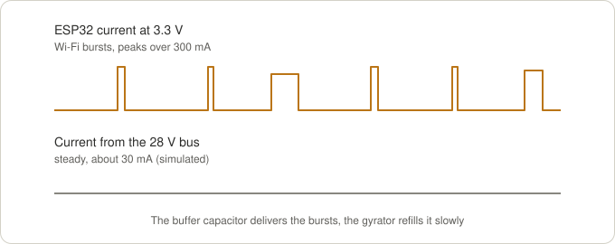
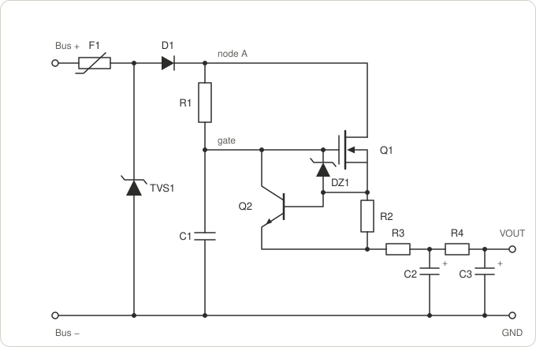

Bus Power Stage (Gyrator)
====

How the ESP32 gateway takes its power from the Siedle bus without damping the speech of the whole building, and
how to build it on a breadboard. Background: [Audio.md](Audio.md).

**Status:** designed and simulated with generic component models ([hardware/bus-power/gyrator.cir](../hardware/bus-power/gyrator.cir)), not built yet. Bring it up on a bench supply before connecting it to the bus.

Why a gyrator
----

The bus carries speech as a small AC voltage on top of its 28 V DC. A plain rectifier with a large capacitor, like
the Arduino prototype's input, has an impedance of about 2 Ω at speech frequencies: it short-circuits the speech
of every call in the building. The gateway also draws its current in Wi-Fi bursts. Passed on to the bus, those
bursts become a buzz in every call.

Others ran into both problems: a 220 µF input capacitor made a door speaker "very, very quiet" for the whole bus,
and an ESP8266 on an LM2596 buck converter made the bus dip by about 3 V every few seconds. Siedle's own phones take
their power through a current source. See [ReverseEngineering.md](ReverseEngineering.md#findings-from-other-projects).

So the power stage has to draw a steady current, whatever the ESP32 does:

Circuit
----

- **D1** keeps the stage from feeding back into the bus while a data frame pulls the bus low, and blocks reverse
  polarity. The receive and transmit circuits connect directly to the bus terminals, **not** behind D1: there,
  Q1's body diode would feed VOUT back into them during a frame (the flaw of the
  [mikrocontroller.net gateway](examples/mikrocontroller-net-308271)).
- **R1 and C1** filter the gate voltage with a time constant of about 2 s. **Q1** follows that filtered voltage, so
  its current cannot follow anything faster than the filter: not the speech on the bus and not the load bursts.
  Seen from the bus, the stage looks like a large inductor.
- **Q2 with R2** limits the current to about 55 mA: during startup (soft start) and if anything behind the stage
  fails. **DZ1** protects the gate of Q1.
- **R3, C2, R4, C3** form a two-stage filter. The capacitors deliver the Wi-Fi bursts and bridge data frames (the
  bus stays below about 8 V for a whole 65 ms frame), the resistors keep the bursts away from Q1.
- **VOUT** (about 20 V) feeds a 5 V buck converter for the D1 Mini.

Parts list
----

| Ref | Part | Value / type | Notes |
|---|---|---|---|
| F1 | Resettable fuse (PTC) | 60 V, hold ≥ 100 mA, e.g. Bourns MF-R010 | protects the building's bus from faults on our side |
| TVS1 | TVS diode | P6KE39A, cathode to bus + | clamps surges; its 33 V working voltage stays above the 32 V while ringing |
| D1 | Diode | 1N4148 (or BAT46) | |
| R1 | Resistor | 1 MΩ | |
| C1 | Film capacitor | 2.2 µF, ≥ 63 V (MKS / MKT) | not electrolytic: its leakage current would pull the gate voltage down |
| Q1 | N-channel MOSFET | IRF540N (IRF520N, IRF530N work too) | 100 V, TO-220, gate threshold ≤ 4 V; small clip-on heatsink for the startup |
| DZ1 | Zener diode | 12 V, 0.5 W (BZX55C12, BZX79C12) | cathode to the gate |
| Q2 | NPN transistor | BC547B (or BC546B) | |
| R2 | Resistor | 10 Ω, 0.25 W | current limit ≈ 0.55 V / 10 Ω |
| R3 | Resistor | 15 Ω, 0.25 W | |
| C2 | Electrolytic capacitor | 2200 µF, 50 V | VOUT reaches about 28 V without load while the bus rings |
| R4 | Resistor | 18 Ω, 0.25 W | |
| C3 | Electrolytic capacitor | 2200 µF, 50 V | |
| U1 | 5 V buck module | Recom R-78CK5.0-0.5 (6.5–40 V in, 5 V / 0.5 A, SIP-3 with the 7805 pinout) | not a Traco TSR 0.5-2450 (32 V max), MP1584 module (28 V max) or Mini-360 (23 V max): too close to the bus voltage |
| R5, R6, C4 | VOUT monitor | 100 kΩ, 10 kΩ, 100 nF | VOUT / 11 to GPIO36 (ADC1), see [firmware requirement](#firmware-requirement) |
| | Test load | 47 Ω, 1 W | on the 5 V output, draws about 0.53 W like the ESP32 with Wi-Fi |

Simulation results
----

ngspice with generic models, bus at 27 V, ESP32 modelled as 0.29 W while booting plus 0.30 W once Wi-Fi runs:

| | Result |
|---|---|
| Startup | current limited to about 50 mA, VOUT reaches 14 V after 3.3 s |
| Steady state | VOUT ≈ 20.3 V, about 31 mA from the bus |
| Data frame (bus below 8 V for 65 ms) | VOUT dips by 0.32 V, about 4 µA flows back into the bus |
| Wi-Fi bursts during a call (1.5 W for 1 ms every 20 ms) | strongest remaining tone in the 300–3400 Hz band: 0.6 µA (single filter stage: 17 µA, no filter: about 1 mA) |
| Impedance toward the bus | about 100 kΩ at 300 Hz–1 kHz, 44 kΩ at 3 kHz (TVS1's capacitance); the old capacitor input: about 2 Ω |

To rerun: `ngspice -b hardware/bus-power/gyrator.cir`.

Bus voltage and current budget
----

- **Voltage:** 26–29 V at idle and up to 32 V while ringing at the power supply, at least 16 V at the farthest
  device (Siedle system manual). The stage drops about 6 V, so for the 14 V Wi-Fi threshold below the bus needs about
  21 V at our connection point. If the measurement shows less, the threshold and the current limit need adapting.
- **Current:** the gateway draws about 31 mA. For comparison, an indoor station draws 6 mA at idle and 30 mA while
  talking, the door loudspeaker 10 mA and 80 mA, and the power supply delivers 500 mA (BNG 650) or 1.2 A (BVNG 650).
  There is no official budget for add-on devices. Before the gateway runs from the bus permanently, check the power
  supply model and the number of stations in the building. Ways to draw less: feed 3.3 V straight into the D1 Mini
  (about a third less), and Wi-Fi power saving while no call is active.

Firmware requirement
----

If the ESP32 starts Wi-Fi as soon as the buck converter runs (from 6.5 V), the stage never gets past about 7 V: at
low input voltage the converter needs more current than the current limit allows, and the two settle into a stall.
The simulation shows exactly that.

So the firmware has to **wait with Wi-Fi until VOUT is above about 14 V**, measured through R5/R6 on GPIO36. Before
Wi-Fi the ESP32 needs little enough power to start up from the current-limited stage. The threshold leaves margin if
the real bus voltage turns out lower than 27 V.

Bring-up
----

1. **Bench supply, no load.** 27 V, current limit about 100 mA if the supply has one. Over about 5 s VOUT rises to
   about 22 V and the input current peaks at no more than 55 mA, then drops below 1 mA.
2. **Short circuit.** Short VOUT for a moment: the current stays at about 55 mA. Keep it short, Q1 heats up.
3. **Load.** Connect U1 and the 47 Ω test load **after** VOUT has settled: about 25–30 mA from the supply,
   VOUT about 20 V. Connected from the start, the test load stalls the stage at about 7 V, as described above.
   Plug U1 in right next to C3: Recom asks for an electrolytic directly at the input when the converter is
   plugged in live above 18 V.
4. **On the bus**, outside office hours. Measure the bus with the scope AC-coupled during a call, with and
   without the stage connected: the speech level must not change. Listen for a buzz.
5. **ESP32 from the stage.** Only with the firmware that waits for 14 V. Until then, connect the D1 Mini after
   VOUT has settled, or power it over USB.

Safety
----

- The bus is a safety extra-low voltage, but the whole building's intercom depends on it. F1 and the current
  limit protect it from mistakes on our side; still, don't short it.
- C2 and C3 hold about 0.5 J each. Discharge them through a resistor before rewiring.
- While the stage is connected to the bus, its ground is the bus minus. A laptop on the D1 Mini's USB port ties
  the bus to the laptop's ground. Do the first tests on the bench supply, and on the bus run the ESP32 without
  USB or through a USB isolator.

Other designs
----

- **[mikrocontroller.net gateway](examples/mikrocontroller-net-308271):** 1N4007, then a gyrator (IRLR024 with 47 kΩ,
  220 kΩ, 100 nF, 33 Ω, filter corner around 34 Hz), an LM2596 buck converter and 3 mF at 3.3 V. Only tested on USB
  power, and its receive and transmit circuits sit behind the diode (see above).
- **Gyrator from the [input capacitor thread](https://www.mikrocontroller.net/topic/343694):** IRLU024N with 47 kΩ,
  220 kΩ and 22 nF. Its gate filter corner is around 190 Hz, so part of the speech still passes. Ours: 2.2 s,
  about 0.07 Hz.
- **[angelnu ESPHome PCB](https://github.com/angelnu/esphome/tree/master/devices/pcb-siedle-bus):** gyrator, diode,
  MP1584 buck converter and a 1 F supercapacitor. The MP1584's 28 V input limit is below the 32 V while ringing, and
  its gyrator values are worth checking before copying.
- **[TCS Doorman](https://github.com/AzonInc/Doorman)** (another 2-wire intercom bus): 62 Ω, Schottky diode and
  470 µF into a buck converter. Its documentation admits a "subtle hissing" on the speaker.

Open points
----

- The current budget of our bus power supply (power supply model, number of stations, a measurement under load).
- Real speech level and bus impedance, to judge the remaining Wi-Fi noise ([Bus-Measurements.md](Bus-Measurements.md)).
- Feeding 3.3 V directly into the D1 Mini instead of 5 V would save about a third of the current, but conflicts
  with plugging in USB. PCB revision 2, with the ESP32 module on the board, gets the saving from a 3.3 V U1
  (R-78CK3.3-0.5, 5–40 V in), see [Audio.md](Audio.md#plan).

### Smaller C2 and C3 (decide after the measurements)

The 2200 µF / 50 V capacitors are the tallest parts of the board (16 mm, lying). Both their voltage and their
capacitance can probably come down; decide once the bus voltage at our terminal is measured.

**Voltage.** C2 and C3 sit one MOSFET threshold plus D1 below the bus, and highest without load. Simulated without
load: 24 V at a 28 V bus, 28 V at 32 V (ringing), 30 V at 34 V; with the ESP32 running about 19–23 V. A real
IRFR120N's lower threshold can add 1–2 V. Short surges never reach them: the gate filter cannot follow, and TVS1
clamps at the input. So 35 V parts are enough if the bus stays at or below 32 V while ringing; 25 V parts are not.

**Capacitance.** The burst filtering depends on R3 × C2 and R4 × C3. Smaller capacitors with larger resistors filter
as well as today. Simulated with 1.5 W Wi-Fi bursts (1 ms every 20 ms), the strongest remaining tone toward the bus
in the speech band:

| C2, C3 | R3 / R4 | Tone on the bus | VOUT | Dip during a frame | Startup to 14 V |
|---|---|---|---|---|---|
| 2200 µF (now) | 15 / 18 Ω | 1.05 µA | 19.1 V | 0.28 V | 3.6 s |
| 1000 µF | 15 / 18 Ω | 1.75 µA | 19.7 V | 0.85 V | 3.2 s |
| 1500 µF | 22 / 27 Ω | 0.69 µA | 18.9 V | 0.48 V | 3.6 s |
| 1000 µF | 33 / 39 Ω | 0.69 µA | 18.1 V | 0.83 V | 4.1 s |

The frame dip stays far above the 14 V Wi-Fi threshold. Larger resistors cost VOUT, so the bus needs a little more
voltage at our terminal (about 22 V instead of 21 V with 33 / 39 Ω).

**Proposal:** 1500 µF / 35 V with 22 / 27 Ω, or 1000 µF / 35 V with 33 / 39 Ω if the bus voltage leaves the margin.
Typical sizes are 10–12.5 mm diameter and 20–25 mm length, so the board gets 3.5–6 mm flatter; check the actual LCSC
parts. The new resistor values also replace the Extended 18 Ω part.

**Prerequisites:**

- The highest bus voltage while ringing ([Bus-Measurements.md](Bus-Measurements.md#1-idle-bus)): at most 32 V for
  35 V parts.
- The bus voltage under load ([Bus-Measurements.md](Bus-Measurements.md#4-power-budget)): enough for the extra
  resistor drop.

**Then:** change C2, C3, R3 and R4 in the schematic, the parts list above and [gyrator.cir](../hardware/bus-power/gyrator.cir),
rerun the simulation, and give C2/C3 a smaller lying footprint in the layout.
